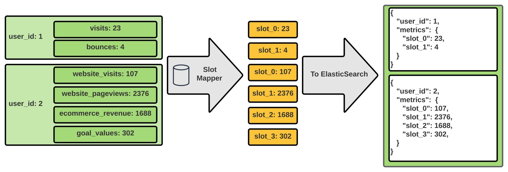

ElasticSearch is a popular OLAP database that allows you to quickly search and aggregate your data in a rich and powerful way.
It is a mature storage technology that has been used to back many online storefronts and analytical processing products 
around the world.
Under the hood, ElasticSearch uses Lucene to index each field in the document so that queries can be executed promptly. 

In order to provide its rich searching capabilities, ES creates indices for each field it receives. The type of index
created is determined by the data type of the field. Possible data types include numeric types such as `integer`, `float`
and `double` as well as two string data types, `keyword` and `text`. By default ES will create the index (and mapping entry)
when a new field is encountered by deducing it's data type. This is called dynamic mapping. 

The problem with dynamic mapping is that once ES introduces a field to the mapping, it can never be removed. The index mapping
also consumes cluster memory and must be replicated to all nodes. If you are not careful, leaving dynamic mapping enabled
can lead to very large index mappings and slow down your cluster. This is called `mapping explosion`. For this reason,
it is best to disable dynamic mapping by default and enable it sparingly for objects that you can trust have a finite number of fields.

In many cases this is not an issue and it is not restrictive to disable dynamic mapping. However, there are some use cases
where a user may determine the name of a field. In such situations, one must come up with a strategy to mitigate the 
risk of an eventual mapping explosion. The rest of this article talks about how we mitigated a mapping explosion in
HootSuite's analytics products.

At Hootsuite, we use ElasticSearch to store social media content and their metrics.
With ElasticSearch, customers can search for content across all their social networks in a multitude of ways. They can
also aggregate metric values from their content over a time range to give them an idea of their social marketing performance.
Social networks provide a finite number of metrics
via their public APIs which we store in separate fields in ES. These fields have the same name as the metric and are common
among all users of the social network. Since there are a finite number of metrics, we have no concern of a mapping explosion.
However, we also collect metrics from offsite attributions such as Google and Adobe Analytics. 
On these platforms, users can name and define their own metrics. These are the metrics we need to be careful about. 
Each customer now has the ability to permanently increase our mapping size by creating a unique metric name. The problem 
is even more serious when you consider these mapping entries will be around long after a customer stopped using that metric.

Disabling these fields in the mapping is not an option. We needed to devise a way to still provide the search and aggregation 
functionality that is so critical to our product functionality, yet also have a stable long tem solution. To overcome
this, we came up with a system we called `Slots`.

## Defusing a mapping explosion

With the slots approach, we gain control of unbounded mapping growth by predefining a fixed number of fields and mapping
them in the application code to the user-defined values. 

Each user will have their own slot-mapping meaning that the metric referred to by each slot will be different for each 
user. The number of slots we need to allocate needs to be, at a minimum, equal to the amount the customer with the most
amount of custom metrics has. Generally speaking, having hundreds or even thousands of fields in an ES mapping is
not as much as an issue as the unbounded growth of the mapping. From looking at our own data, the customer with the largest
amount of custom metrics had about 200 metrics. To be safe, we allocated 1000 slots.

## Trade offs

The slots approach is not without it's caveats. For one, it makes debugging and reading data more difficult. Now if we
go into Kibana, rather than seeing a field named `custom_metric_c` we see `slot_3`. We need to refer back to the slot-mapping
to determine which slot refers to the metric we are looking for.

Second, we must be careful that there are no requests for data that access documents that use different slot-mappings as
the results will not make sense. You cannot aggregate `slot_2` across data from two different customers because the metric
`slot_2` refers to will be different. Luckily, aggregating across customers is not a valid business case and in fact
goes again our multi-tenant principles.

Third, a customer may eventually hit their 1000 slot limit by renaming or adding new metrics that they use temporarily.
This has yet to happen but there are avenues for when it possibly does. We can reclaim some of the slots that are no longer
in use by going through data and removing the values from documents. Alternatively, we can simply increase the maximum 
slots.

## Defining the slot mapping

Each metric, whether it be from the social network or user defined, has a unique ID and some metadata associated with it
called the `metric definition`. At first it may be tempting to store the slot number on the metric definition, however
there are two problems with this approach:

1. The metric definitions are in a separate service than the service which stores the metric values. Without going into
too much detail, the reason for this is because there are many services and entities that store metric values and 
replicating the definitions to each of them was deemed too much overhead.

2. The slot is an implementation detail of the fact that we use ES as a storage backend. By exposing the slots outside of
the service performing the translation to/from metric name to slot, we are weakening our abstraction.

Instead, we had the services that write to ES each define their own slot-mappings. The slot mapping is defined the first 
time the service writes the metric to ES. The flow requires us to keep a counter for the current number of slots for a user
and also the relationship between slot and metric name.

**Table: slot_counters**
| user_id 	 | n_slots 	 | 
|-----------|-----------|
| 1       	 | 2       	 |
| 2       	 | 4       	 |
| 3       	 | 0       	 |

**Table 1: The slot_counters table keeps track of the number of slots each user has used.**

**Table: slot_mappings**
| user_id 	| slot 	| metric            	|
|---------	|------	|-------------------	|
| 1       	| 0    	| visits            	|
| 1       	| 1    	| bounces           	|
| 2       	| 0    	| website_visits    	|
| 2       	| 1    	| website_pageviews 	|
| 2       	| 2    	| ecommerce_revenue 	|
| 2       	| 3    	| goal_values       	|

**Table 2: The slot_mappings table contains the relationships between slot and metric for each user. It has a unique
constraint on combinations of (user_id, slot).**

When a new metric is written, the counter is incremented and a new slot-mapping row is written. The relationship between
slot and metric name must also have a unique compound index on the `user_id` and `slot` columns. This unique index prevents
potential race conditions from multiple API requests trying to grab the next slot number. In the case of a race condition, 
one of the attempts to save the slot-mapping will fail on the unique-constraint and we can roll back the transaction and
simply retry again.  

Before writing to ES, all metric names are converted to slot numbers. When reading or aggregating metrics,
the slot values retrieved from ES are translated back to the metric names with the same slot-mapping. This whole process
is completely transparent to the user of the API.

A small LRU caching layer is added around the metric slot-mapping values to reduce the number of times we need to go
to the database. Since these values are static and small, this ends up working very well.
